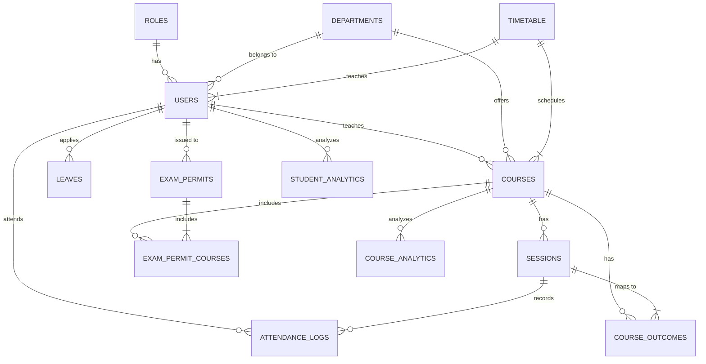

# Aura Integrity Engine - MySQL Database Schema

Comprehensive database schema for the Aura Integrity Engine project, designed to manage academic records, attendance, leave applications, and exam permits for three user roles: Admin, Faculty, and Student.

## Database Architecture

The schema is structured into 7 main modules:

1. **Roles & Users** - User management with role-based access
2. **Academic Structure** - Departments, courses, and course outcomes
3. **Sessions & Attendance** - Live session management and attendance tracking
4. **Leave Management** - Student leave applications and approval workflow
5. **Exam Management** - Exam permits and eligibility checking
6. **Timetable** - Academic schedule management
7. **Analytics & Reports** - Course and student analytics

## Entity-Relationship Diagram



## Table Structure

### 1. Roles & Users

#### `roles` - User Role Definitions

```sql
CREATE TABLE roles (
  id VARCHAR(50) PRIMARY KEY,
  name VARCHAR(100) NOT NULL UNIQUE,
  description TEXT,
  created_at TIMESTAMP DEFAULT CURRENT_TIMESTAMP,
  updated_at TIMESTAMP DEFAULT CURRENT_TIMESTAMP ON UPDATE CURRENT_TIMESTAMP
)
```

#### `users` - User Accounts

```sql
CREATE TABLE users (
  id VARCHAR(50) PRIMARY KEY,
  name VARCHAR(255) NOT NULL,
  email VARCHAR(255) NOT NULL UNIQUE,
  password VARCHAR(255) NOT NULL,
  role_id VARCHAR(50) NOT NULL,
  phone VARCHAR(20),
  department VARCHAR(100),
  semester INT,
  device_id VARCHAR(100),
  parent_phone VARCHAR(20),
  parent_email VARCHAR(255),
  designation VARCHAR(100),
  created_at TIMESTAMP DEFAULT CURRENT_TIMESTAMP,
  updated_at TIMESTAMP DEFAULT CURRENT_TIMESTAMP ON UPDATE CURRENT_TIMESTAMP,
  FOREIGN KEY (role_id) REFERENCES roles(id) ON DELETE CASCADE ON UPDATE CASCADE
)
```

### 2. Academic Structure

#### `departments` - Academic Departments

```sql
CREATE TABLE departments (
  id VARCHAR(50) PRIMARY KEY,
  name VARCHAR(255) NOT NULL UNIQUE,
  hod VARCHAR(255),
  total_students INT DEFAULT 0,
  avg_attendance DECIMAL(5,2) DEFAULT 0.00,
  created_at TIMESTAMP DEFAULT CURRENT_TIMESTAMP,
  updated_at TIMESTAMP DEFAULT CURRENT_TIMESTAMP ON UPDATE CURRENT_TIMESTAMP
)
```

#### `courses` - Academic Courses

```sql
CREATE TABLE courses (
  id VARCHAR(50) PRIMARY KEY,
  name VARCHAR(255) NOT NULL,
  department VARCHAR(100) NOT NULL,
  semester INT NOT NULL,
  credits INT NOT NULL,
  faculty_id VARCHAR(50) NOT NULL,
  total_sessions INT DEFAULT 0,
  completed_sessions INT DEFAULT 0,
  created_at TIMESTAMP DEFAULT CURRENT_TIMESTAMP,
  updated_at TIMESTAMP DEFAULT CURRENT_TIMESTAMP ON UPDATE CURRENT_TIMESTAMP,
  FOREIGN KEY (faculty_id) REFERENCES users(id) ON DELETE CASCADE ON UPDATE CASCADE
)
```

#### `course_outcomes` - Course Learning Outcomes

```sql
CREATE TABLE course_outcomes (
  id VARCHAR(50) PRIMARY KEY,
  course_id VARCHAR(50) NOT NULL,
  description TEXT NOT NULL,
  bloom_level VARCHAR(100),
  attainment DECIMAL(5,2) DEFAULT 0.00,
  created_at TIMESTAMP DEFAULT CURRENT_TIMESTAMP,
  updated_at TIMESTAMP DEFAULT CURRENT_TIMESTAMP ON UPDATE CURRENT_TIMESTAMP,
  FOREIGN KEY (course_id) REFERENCES courses(id) ON DELETE CASCADE ON UPDATE CASCADE
)
```

### 3. Sessions & Attendance

#### `sessions` - Live Class Sessions

```sql
CREATE TABLE sessions (
  id VARCHAR(50) PRIMARY KEY,
  course_id VARCHAR(50) NOT NULL,
  topic VARCHAR(255) NOT NULL,
  co_id VARCHAR(50),
  date DATE NOT NULL,
  time VARCHAR(50) NOT NULL,
  room VARCHAR(100),
  faculty_id VARCHAR(50) NOT NULL,
  status ENUM('upcoming', 'completed', 'cancelled') DEFAULT 'upcoming',
  present INT DEFAULT 0,
  total INT DEFAULT 0,
  created_at TIMESTAMP DEFAULT CURRENT_TIMESTAMP,
  updated_at TIMESTAMP DEFAULT CURRENT_TIMESTAMP ON UPDATE CURRENT_TIMESTAMP,
  FOREIGN KEY (course_id) REFERENCES courses(id) ON DELETE CASCADE ON UPDATE CASCADE,
  FOREIGN KEY (co_id) REFERENCES course_outcomes(id) ON DELETE SET NULL ON UPDATE CASCADE,
  FOREIGN KEY (faculty_id) REFERENCES users(id) ON DELETE CASCADE ON UPDATE CASCADE
)
```

#### `attendance_logs` - Attendance Records

```sql
CREATE TABLE attendance_logs (
  id VARCHAR(50) PRIMARY KEY,
  student_id VARCHAR(50) NOT NULL,
  session_id VARCHAR(50) NOT NULL,
  status ENUM('present', 'late', 'absent') DEFAULT 'absent',
  timestamp DATETIME,
  method VARCHAR(50),
  gps_valid BOOLEAN DEFAULT FALSE,
  ip_valid BOOLEAN DEFAULT FALSE,
  created_at TIMESTAMP DEFAULT CURRENT_TIMESTAMP,
  updated_at TIMESTAMP DEFAULT CURRENT_TIMESTAMP ON UPDATE CURRENT_TIMESTAMP,
  FOREIGN KEY (student_id) REFERENCES users(id) ON DELETE CASCADE ON UPDATE CASCADE,
  FOREIGN KEY (session_id) REFERENCES sessions(id) ON DELETE CASCADE ON UPDATE CASCADE,
  UNIQUE KEY unique_attendance (student_id, session_id)
)
```

### 4. Leave Management

#### `leaves` - Leave Applications

```sql
CREATE TABLE leaves (
  id VARCHAR(50) PRIMARY KEY,
  student_id VARCHAR(50) NOT NULL,
  type ENUM('Medical', 'On-Duty', 'Personal') NOT NULL,
  start_date DATE NOT NULL,
  end_date DATE NOT NULL,
  reason TEXT NOT NULL,
  status ENUM('pending', 'approved', 'rejected') DEFAULT 'pending',
  document VARCHAR(255),
  approved_by VARCHAR(50),
  approved_at DATETIME,
  created_at TIMESTAMP DEFAULT CURRENT_TIMESTAMP,
  updated_at TIMESTAMP DEFAULT CURRENT_TIMESTAMP ON UPDATE CURRENT_TIMESTAMP,
  FOREIGN KEY (student_id) REFERENCES users(id) ON DELETE CASCADE ON UPDATE CASCADE,
  FOREIGN KEY (approved_by) REFERENCES users(id) ON DELETE SET NULL ON UPDATE CASCADE
)
```

### 5. Exam Management

#### `exam_permits` - Exam Hall Tickets

```sql
CREATE TABLE exam_permits (
  id VARCHAR(50) PRIMARY KEY,
  student_id VARCHAR(50) NOT NULL,
  exam_name VARCHAR(255) NOT NULL,
  department VARCHAR(100) NOT NULL,
  semester INT NOT NULL,
  overall_eligible BOOLEAN DEFAULT FALSE,
  issued_at DATETIME,
  created_at TIMESTAMP DEFAULT CURRENT_TIMESTAMP,
  updated_at TIMESTAMP DEFAULT CURRENT_TIMESTAMP ON UPDATE CURRENT_TIMESTAMP,
  FOREIGN KEY (student_id) REFERENCES users(id) ON DELETE CASCADE ON UPDATE CASCADE
)
```

#### `exam_permit_courses` - Course-wise Eligibility

```sql
CREATE TABLE exam_permit_courses (
  id VARCHAR(50) PRIMARY KEY,
  permit_id VARCHAR(50) NOT NULL,
  course_id VARCHAR(50) NOT NULL,
  attendance DECIMAL(5,2) DEFAULT 0.00,
  eligible BOOLEAN DEFAULT FALSE,
  created_at TIMESTAMP DEFAULT CURRENT_TIMESTAMP,
  updated_at TIMESTAMP DEFAULT CURRENT_TIMESTAMP ON UPDATE CURRENT_TIMESTAMP,
  FOREIGN KEY (permit_id) REFERENCES exam_permits(id) ON DELETE CASCADE ON UPDATE CASCADE,
  FOREIGN KEY (course_id) REFERENCES courses(id) ON DELETE CASCADE ON UPDATE CASCADE,
  UNIQUE KEY unique_permit_course (permit_id, course_id)
)
```

### 6. Timetable

#### `timetable` - Academic Schedule

```sql
CREATE TABLE timetable (
  id VARCHAR(50) PRIMARY KEY,
  day VARCHAR(50) NOT NULL,
  time VARCHAR(50) NOT NULL,
  course_id VARCHAR(50) NOT NULL,
  room VARCHAR(100),
  faculty_id VARCHAR(50) NOT NULL,
  created_at TIMESTAMP DEFAULT CURRENT_TIMESTAMP,
  updated_at TIMESTAMP DEFAULT CURRENT_TIMESTAMP ON UPDATE CURRENT_TIMESTAMP,
  FOREIGN KEY (course_id) REFERENCES courses(id) ON DELETE CASCADE ON UPDATE CASCADE,
  FOREIGN KEY (faculty_id) REFERENCES users(id) ON DELETE CASCADE ON UPDATE CASCADE,
  UNIQUE KEY unique_timetable_slot (day, time, course_id)
)
```

### 7. Analytics & Reports

#### `course_analytics` - Course Performance Metrics

```sql
CREATE TABLE course_analytics (
  id VARCHAR(50) PRIMARY KEY,
  course_id VARCHAR(50) NOT NULL,
  semester INT NOT NULL,
  avg_attendance DECIMAL(5,2) DEFAULT 0.00,
  pass_rate DECIMAL(5,2) DEFAULT 0.00,
  co_attainment JSON,
  total_students INT DEFAULT 0,
  last_updated DATETIME,
  created_at TIMESTAMP DEFAULT CURRENT_TIMESTAMP,
  updated_at TIMESTAMP DEFAULT CURRENT_TIMESTAMP ON UPDATE CURRENT_TIMESTAMP,
  FOREIGN KEY (course_id) REFERENCES courses(id) ON DELETE CASCADE ON UPDATE CASCADE
)
```

#### `student_analytics` - Student Performance Metrics

```sql
CREATE TABLE student_analytics (
  id VARCHAR(50) PRIMARY KEY,
  student_id VARCHAR(50) NOT NULL,
  department VARCHAR(100),
  semester INT,
  overall_attendance DECIMAL(5,2) DEFAULT 0.00,
  course_wise_attendance JSON,
  leave_count INT DEFAULT 0,
  late_count INT DEFAULT 0,
  last_updated DATETIME,
  created_at TIMESTAMP DEFAULT CURRENT_TIMESTAMP,
  updated_at TIMESTAMP DEFAULT CURRENT_TIMESTAMP ON UPDATE CURRENT_TIMESTAMP,
  FOREIGN KEY (student_id) REFERENCES users(id) ON DELETE CASCADE ON UPDATE CASCADE
)
```

## Indexing Strategy

The schema includes comprehensive indexing for optimal query performance:

### User Indexes

- `idx_users_role` - For role-based queries
- `idx_users_department` - For department-specific queries
- `idx_users_semester` - For semester-specific queries

### Course Indexes

- `idx_courses_department` - For department course listings
- `idx_courses_semester` - For semester course listings
- `idx_courses_faculty` - For faculty course listings

### Session Indexes

- `idx_sessions_course` - For course session listings
- `idx_sessions_faculty` - For faculty session listings
- `idx_sessions_date` - For date-based session queries
- `idx_sessions_status` - For status-based session queries

### Attendance Indexes

- `idx_attendance_student` - For student attendance history
- `idx_attendance_session` - For session attendance reports
- `idx_attendance_status` - For status-based attendance queries

### Leave Indexes

- `idx_leaves_student` - For student leave history
- `idx_leaves_status` - For leave status queries
- `idx_leaves_date` - For date range leave queries

### Exam Permit Indexes

- `idx_permits_student` - For student permit queries
- `idx_permits_eligible` - For eligibility-based queries

### Timetable Indexes

- `idx_timetable_day` - For day-based schedule queries
- `idx_timetable_course` - For course schedule queries
- `idx_timetable_faculty` - For faculty schedule queries

### Analytics Indexes

- `idx_course_analytics_course` - For course analytics queries
- `idx_course_analytics_semester` - For semester analytics queries
- `idx_student_analytics_student` - For student analytics queries
- `idx_student_analytics_semester` - For semester student analytics queries

## Data Integrity Constraints

### Foreign Key Constraints

All relationships include appropriate foreign key constraints with cascading delete and update behaviors:

- `ON DELETE CASCADE` - Deletes related records when parent record is deleted
- `ON DELETE SET NULL` - Sets foreign key to NULL when parent record is deleted
- `ON UPDATE CASCADE` - Updates foreign key values when parent record is updated

### Unique Constraints

- `email` in `users` - Ensures unique email addresses
- `unique_attendance` - Prevents duplicate attendance records
- `unique_permit_course` - Prevents duplicate course entries in exam permits
- `unique_timetable_slot` - Prevents overlapping timetable slots

### Not Null Constraints

All essential fields have NOT NULL constraints to ensure data completeness.

### Default Values

Fields with predictable default values have appropriate defaults:

- Timestamps default to `CURRENT_TIMESTAMP`
- Boolean fields default to `FALSE`
- Numeric fields default to `0`

## Initial Seed Data

The schema includes initial seed data for:

- 3 user roles (Admin, Faculty, Student)
- 3 departments (CSE, ECE, ME)
- 4 faculty members
- 10 students
- 5 courses with course outcomes
- 8 sessions (4 completed, 4 upcoming)
- 10 attendance records
- 4 leave applications
- 1 exam permit with 3 courses
- Timetable for Monday-Friday

## SQL Scripts

For actual implementation, you'll need to:

1. Create the database
2. Execute the table creation scripts
3. Insert initial seed data
4. Create indexes

The complete SQL scripts can be found in `prisma/schema.sql`.

## Technology Stack

- **Database**: MySQL 8.0+
- **Character Set**: utf8mb4 (supports all Unicode characters)
- **Collation**: utf8mb4_unicode_ci (case-insensitive)
- **Engine**: InnoDB (supports transactions and foreign keys)

## Security Considerations

1. **Password Hashing**: Always use strong hashing algorithms (bcrypt recommended)
2. **Input Validation**: Validate all user input to prevent SQL injection
3. **Access Control**: Implement role-based access control using the `roles` table
4. **Regular Backups**: Schedule regular database backups
5. **Connection Security**: Use SSL/TLS for database connections

## Performance Optimization

1. **Indexing**: All frequent query patterns are indexed
2. **JSON Fields**: Analytics tables use JSON for flexible data storage
3. **Normalization**: Schema is properly normalized to reduce redundancy
4. **Query Optimization**: Use JOINs efficiently and avoid unnecessary data retrieval
5. **Caching**: Consider implementing query caching for frequently accessed data
